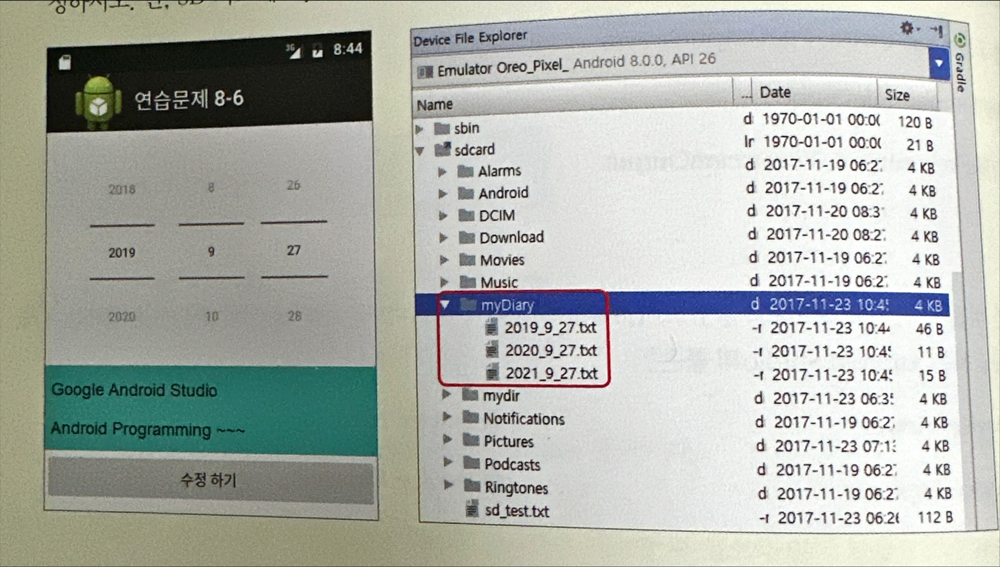
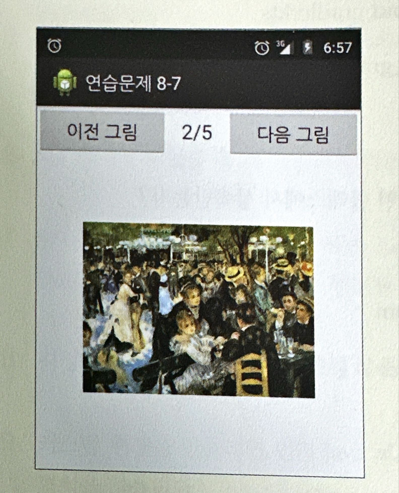

# Achieve8

- [ ] Achieve8-6
- [ ] Achieve8-7

[직접 풀어보기 8-1]의 일기장 앱을 내장 메모리가 아닌 SD 카드의 myDiary 폴더에 저장되도록 수정하시오. 단, SD 카드에 
myDiary가 없으면 Java 코드에서 자동 생성되게 한다. 

다음과 같이 '현재 번호/전체 번호'가 표시되고 그림이 가운데에 위치하도록 [실습 8-2]를 수정하시오. 
